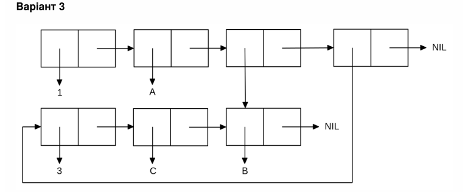

<p align="center"><b>МОНУ НТУУ КПІ ім. Ігоря Сікорського ФПМ СПіСКС</b></p>
<p align="center">
<b>Звіт з лабораторної роботи 1</b><br/>
"Обробка списків з використанням базових функцій"<br/>
дисципліни "Вступ до функціонального програмування"
</p>
<p align="right">
    <strong>Студент</strong>: <em><strong>Чередник Костянтин Анатолійович</strong></em>
</p>
<p align="right">
    <strong>Група</strong>: <em><strong>КВ-21</strong></em>
</p>
<p align="right">
    <strong>Рік</strong>: <em><strong>2025</strong></em>
</p>

## Реалізація завдання 

```lisp

;;1
CL-USER> (defparameter *list* (cons 'A (cons 13 (cons (list 'k 'l) (cons NIL (cons 'kv-21 NIL))))))
*list*
(A 13 (K L) NIL KV-21)

;;2
CL-USER> (car *list*)
A

;;3
CL-USER> (cdr *list*)
(13 (K L) NIL KV-21)

;;4
CL-USER> (third *list*)
(K L)
CL-USER> (caddr *list*)
(K L)

;;5
CL-USER> (last *list*)
(KV-21
CL-USER> (car (last *list*))
KV-21
CL-USER> (nth 4 *list*)
KV-21

;;6
CL-USER> (atom (car *list*))
T
CL-USER> (atom (third *list*))
NIL
CL-USER> (atom NIL)
T
CL-USER> (listp *list*)
T
CL-USER> (listp (third *list*))
T
CL-USER> (listp (car *list*))
NIL


;;7
CL-USER> (let ((x (second *list*)) (y (car (cdr *list*)))) (eq x y))
T
CL-USER> (eq (third *list*) '(K L))
NIL
CL-USER> (equal (third *list*) '(K L))
T
CL-USER> (and (numberp (second *list*)) (symbolp (car *list*)))
T
CL-USER> (null NIL)
T


;;8
CL-USER> (append *list* (third *list*))
(A 13 (K L) NIL KV-21 K L)

```

Варіант 3(19)
<p align="center">

</p>


```lisp
CL-USER>  (set 'l '(3 c b))
(list 1 'a (nthcdr 2 l) l)
(1 A (B) (3 C B))
```
